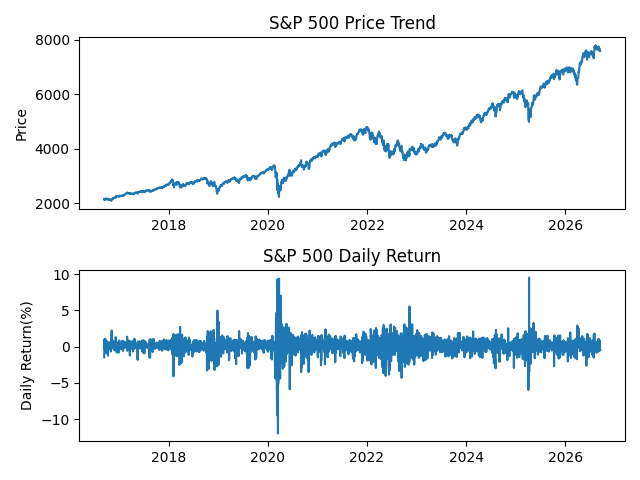

# SP500 Tracker

这是咱的第一个完整 Python 数据项目 (≧▽≦)

一直想好好学python但是苦于永远停留在语法，停留在增删查改，于是某一天终于决定开始从GitHub上的项目开始学习了喵

但是刷着刷着 pandas_exercises 感觉有点无聊了 qwq，

于是想找点自己真正感兴趣的数据玩玩。

刚好最近在看 S&P 500，尽管大家都说定投标普这是一种傻瓜式投资，但我还是想自己看看怎么个事，所以就从这里开始喵。

## 目前实现

- 从 FRED 获取 S&P 500 数据
- 清洗缺失数据
- 计算每日收益率
- 自动检测并更新最新数据
- 网络请求失败自动重试（这里折腾了我半天 qwq）
- 使用 Matplotlib 画图

## 运行结果

## 接下来

准备尝试 GitHub Actions，让它每天自己更新。

如果成功的话，这个项目就不用我每天手动运行了喵 (๑•̀ㅂ•́)و✧

## 更新日志

### V1.2
尝试让项目进行自动化运行，选择了GitHub Actions作为自动化运行环境。

- 在网络请求连续失败时加入进程退出码，使 GitHub Actions 能正确识别程序运行失败
- 添加了`requirements.txt`，记录项目所需要的python第三方依赖
- 添加了`.github/workflows/update.yml`，用于配置 GitHub Actions 自动运行流程
- 为了适配 Ubuntu 运行环境，暂时移除绘图中的中文字体设置，并将图表文字改为英文

### V1.1 
`daily_return`这一项的第一行因为没有前一天的数据，本来就是`NaN`。
但是旧代码直接使用了`dropna()`导致了程序每运行一次都会删掉一行历史数据...

也就是说程序看起来是在正常运行，但数据其实在偷偷变少(悲)。

- 在gpt老师的帮助下，学会了一套数据处理逻辑————先确定可信的基础数据，然后进行合并、去重、排序，最后再进行计算。
- 同时完成了函数拆分，将程序拆分为 `fetch_data()`、`clean_data()`、`merge_data()`、`paint()` 和 `main()`

### V1.0
完成第一个可运行版本：
- 从 FRED 获取 S&P 500 数据
- 保存本地 CSV
- 计算每日收益率
- 使用 Matplotlib 绘制价格与收益率图